# BitHaven 555 Badge — Beginner Solder & Assembly Guide (One Badge)

Welcome! This is a **555 "breathing" LED badge**. When it's built and powered, its **two LED "eyes"
slowly fade up and down together** — a calm breathing glow, about one breath every 3 seconds. No
computer, no code, all hand-soldered. If this is your **first ever solder project, you're in the right
place** — every step is spelled out.

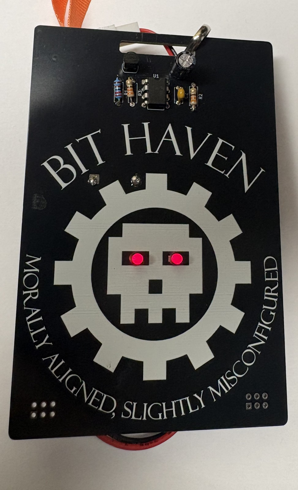
*The finished badge on a lanyard — both LED "eyes" lit and breathing.*

> 📋 **Parts list:** see [`BOM.csv`](BOM.csv).

> ⏱️ **Time:** ~30–45 min · **Difficulty:** beginner · **Skills you'll learn:** through-hole soldering,
> reading part orientation, polarity, and a real "bring-up + debug."

---

## ⚠️ Read this first — the one required fix (bodge)

**This board revision (Rev 1) has a known bug:** the transistor's
**collector pin is not connected to power**, so **the LEDs won't light until you add one short jumper
wire.** It's a 2-minute fix and you'll do it in **Step 8**. Don't skip it — the badge stays dark without
it. (A corrected board revision fixes this in the design; this batch just needs the jumper.)

---

## What you need

**In your kit (per badge):**

| #   | Ref        | Part                      | Value / marking                        | Notes                            |
| --- | ---------- | ------------------------- | -------------------------------------- | -------------------------------- |
| 1   | **U1**     | 555 timer IC              | NE555P (8-pin chip)                    | + an 8-pin socket if included    |
| 1   | **Q1**     | Transistor                | 2N3904 (black half-moon, 3 legs)       | orientation matters — see Step 4 |
| 1   | **R1**     | Resistor                  | **22 kΩ** (red-red-orange-gold)        | sets the breathe speed           |
| 2   | **R2, R3** | Resistors                 | **220 Ω** (red-red-brown-gold)         | one per LED                      |
| 1   | **C1**     | Electrolytic capacitor    | **100 µF** (barrel, has + and −)       | **polarity matters**             |
| 1   | **C2**     | Ceramic capacitor         | **0.01 µF** (small disc, marked "103") | no polarity                      |
| 2   | **D1, D2** | LEDs (the "eyes")         | 3 mm, any color                        | **polarity matters**             |
| 1   | **BT1**    | Battery holder            | **3×AA**                               | holds 3 AA batteries = 4.5 V     |
| 2   | **X1, X2** | **SAO add-on connectors** | 2×3 pin header                         | optional expansion — see Step 6  |
| —   | —          | Jumper wire               | small offcut                           | for the required bodge (Step 8)  |
| 3   | —          | AA batteries              | —                                      | you may need to supply your own  |

**Tools:**
- Soldering iron (~330–350 °C / 620–660 °F) + a damp sponge or brass tip cleaner
- Solder (thin rosin-core, 0.6–0.8 mm)
- Flush cutters (to trim leads)
- Optional but great: helping hands / a vise, safety glasses

> 🥽 **Safety:** the iron tip is ~350 °C — it *will* burn you and the bench. Rest it in its stand every
> time. **Wear eye protection** (clipped leads fly). Work in a **ventilated** spot — don't breathe the
> smoke. Wash your hands after (leaded solder).

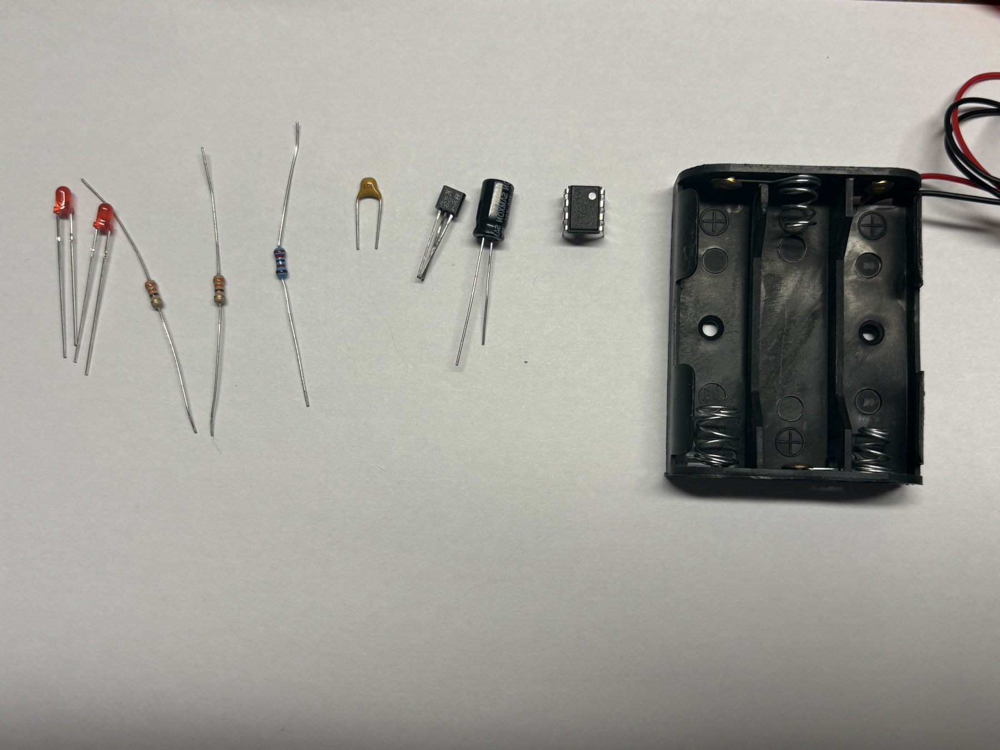
*Every part in the kit, laid out left-to-right: the two LED "eyes," the three resistors, the ceramic "103" cap, the 2N3904 transistor, the 100 µF electrolytic, the NE555P chip, and — the tallest, soldered last — the 3×AA battery holder.*

---

## Reading resistor colors (quick helper)

Resistors don't have numbers printed — they use color bands. For this kit:

- **22 kΩ (R1):** 🔴 red · 🔴 red · 🟠 orange · 🟡 gold-ish (tolerance)
- **220 Ω (R2, R3):** 🔴 red · 🔴 red · 🟤 brown · gold

If unsure, a cheap multimeter on "Ω" tells you the exact value — measure before soldering.

---
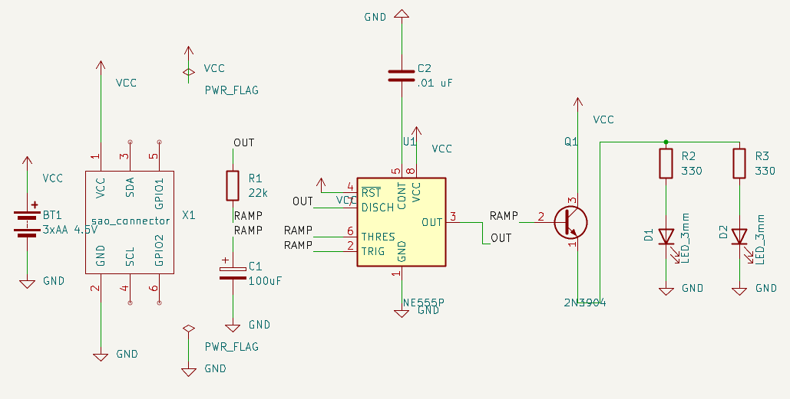
## Know your board — front & back

Before you place a single part, get oriented. Keep these two photos of the **bare board** next to you
while you solder — every part goes where its **silkscreen outline and label** tell it to.

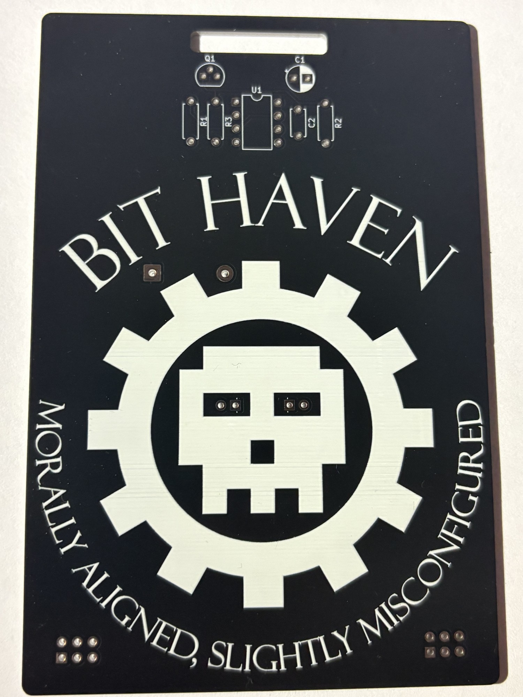
*Front (logo side): the BIT HAVEN silkscreen — you can pick out the outlines for **R1, R2, C1, C2, U1** and the two LED "eyes."*

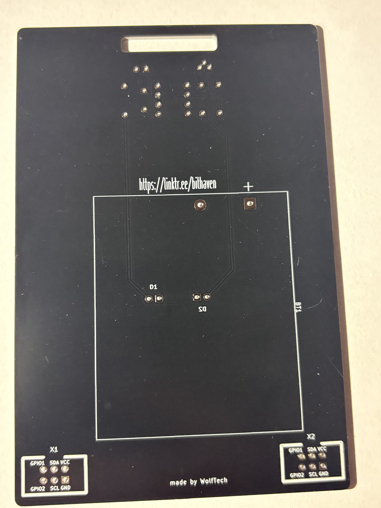
*Back: the **battery holder (BT1)** footprint, the two **SAO ports (X1, X2)**, and the "made by WolfTech" mark.*

---

## The golden rule of order: **low-profile first, tallest last**

You solder from the **flattest parts to the tallest** so the board lies flat on the bench while you
work. We lead with the **IC socket** (easiest to drop in before the board fills up), move through the
flat parts, and finish with the **tall electrolytic cap and battery holder**. Follow the step order
below and you can't go wrong.

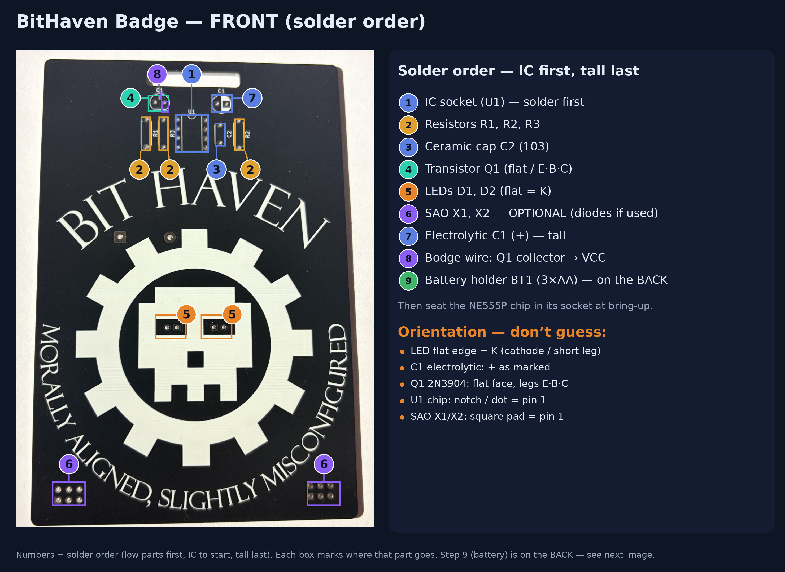

*Front — a numbered box on each part's actual spot (①–⑧ = solder order); the full order and "don't
guess" orientation notes are on the right. Match each box to the **printed label on your own board.***

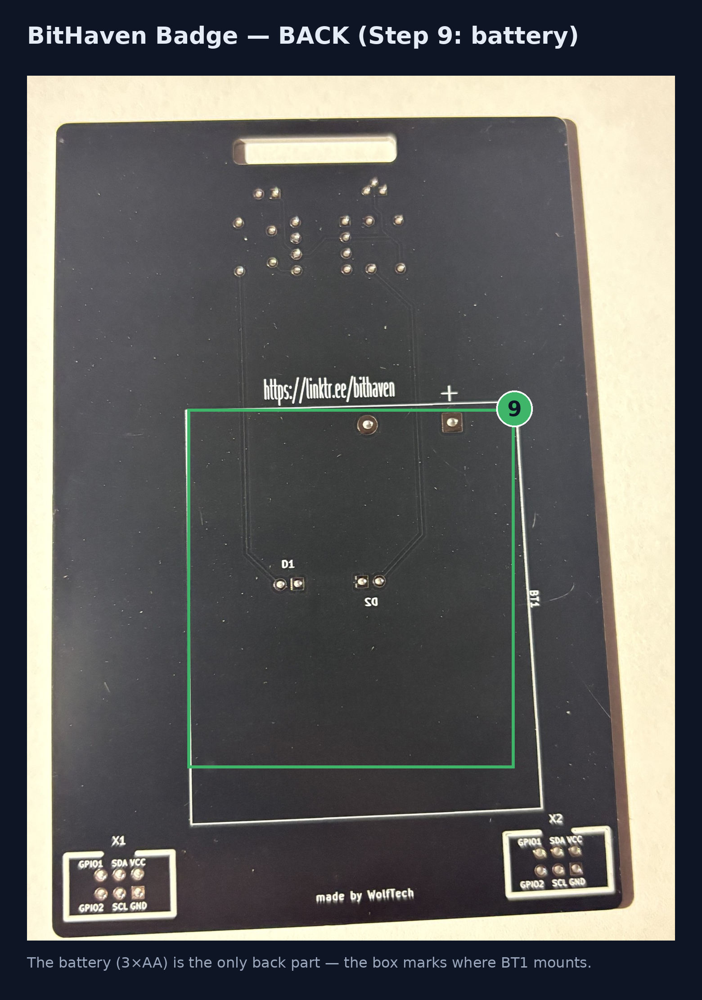

*Back — the **battery (BT1, step ⑨)** is the only part on this side.*

### Step 1 — The IC socket / U1 (do this first)
Start with the **8-pin socket** (or, if your kit has no socket, the **NE555P chip** itself) — it's
low-profile and easiest to place before the board fills up. Solder it now, and **match the notch** on
the socket to the notch/dot printed on the board; that mark tells you which way the chip faces. If
you're using a socket, **don't solder the chip yet** — you'll press the NE555P into the socket at
bring-up.

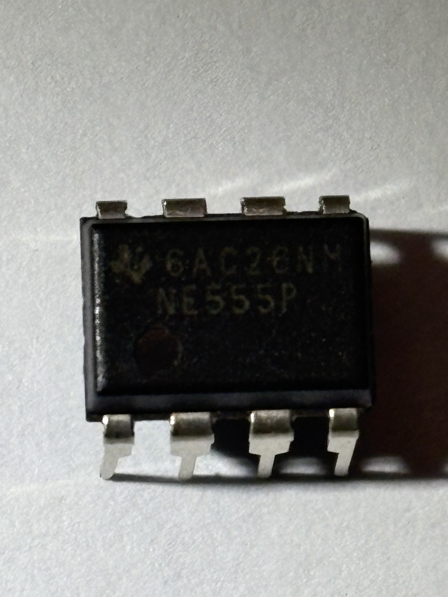
*Pin-1 marker on the NE555P: the small dimple/dot at one corner (and the notch on that end). The **socket, the chip, and the board's silkscreen mark all face this way** — line them up so pin 1 matches.*

### Step 2 — Resistors (R1, R2, R3)
Resistors have **no polarity** — either direction is fine. Bend the legs, push through from the
printed side, splay the legs slightly so it won't fall out, flip the board, solder both legs, snip the
excess. **R1 = 22 kΩ**, **R2 & R3 = 220 Ω**.

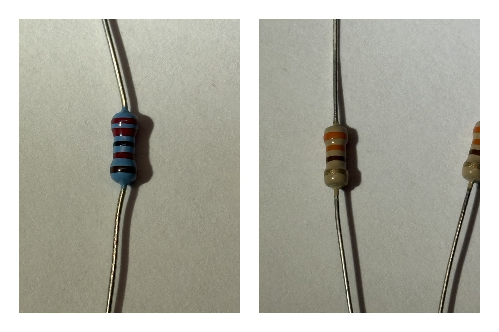

### Step 3 — Ceramic capacitor (C2, "103")
The small disc marked **103** (that's 0.01 µF). **No polarity** — either way is fine.

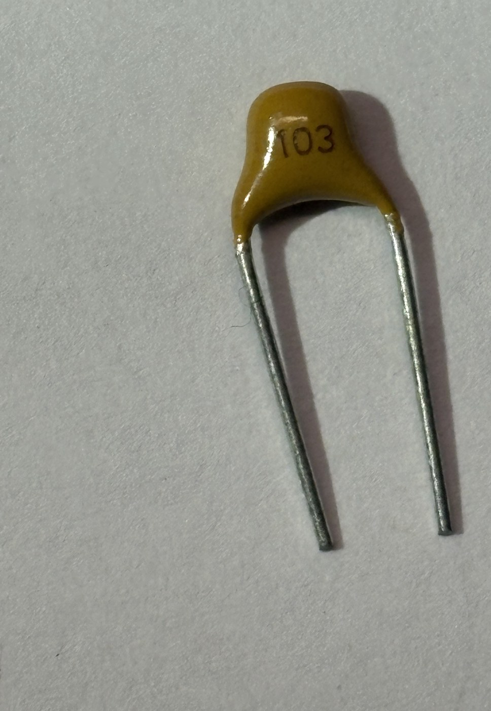

### Step 4 — Transistor Q1 (2N3904) — **orientation matters**
The 2N3904 has a **flat face** and a rounded back. The board's silkscreen shows a matching **flat
line** — line them up. Its three legs, **flat face toward you, legs pointing down, are E · B · C**
(Emitter, Base, Collector) left-to-right. Push it in so it matches the outline, solder, trim.

> ⚠️ Don't force a **BC548** into this spot — that part is wired backwards (C·B·E). Use the **2N3904**.

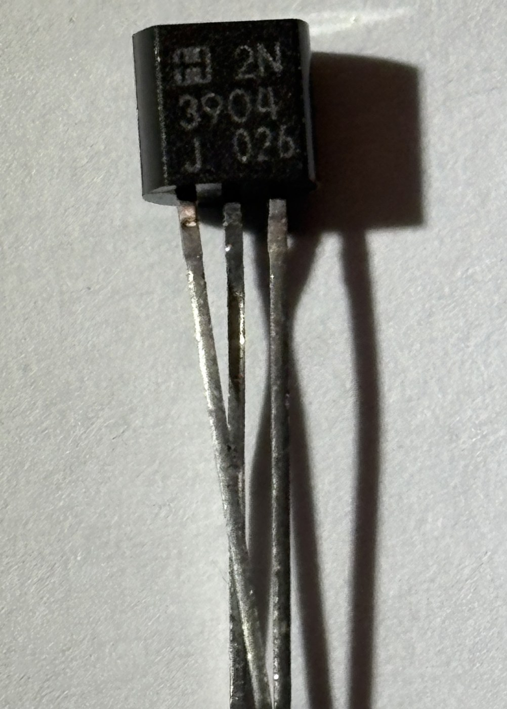

### Step 5 — LEDs (D1, D2) — **polarity matters**
Each LED has a **long leg (+, anode)** and a **short leg / flat edge on the rim (−, cathode)**. The
board marks the flat/cathode side — match it. Backwards = it just won't light. Solder both "eyes."

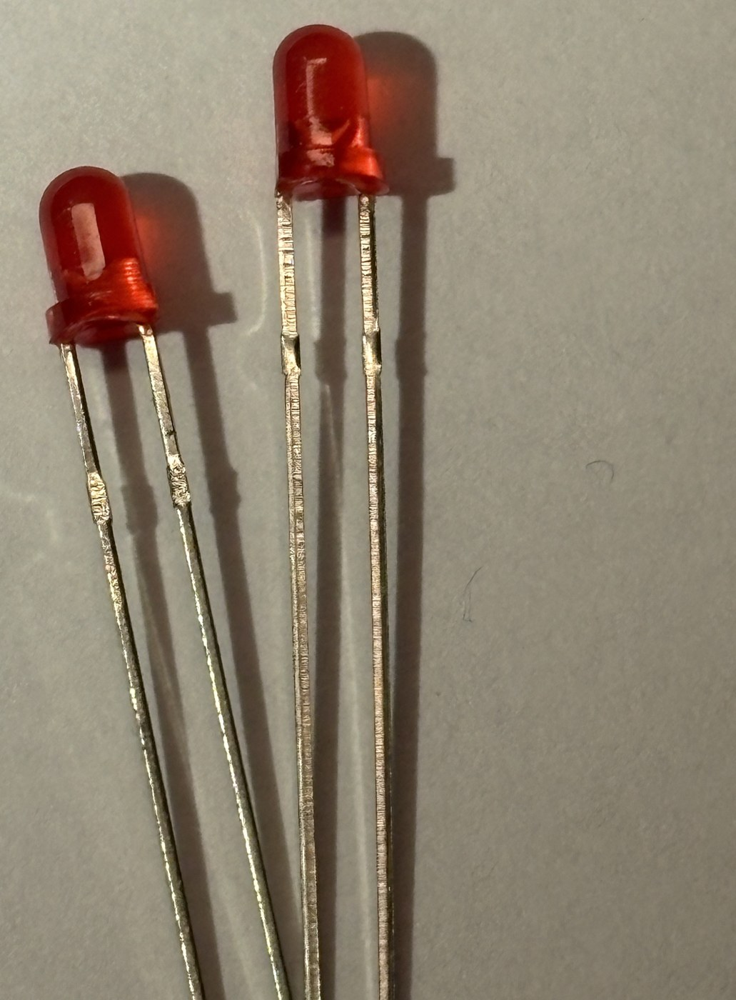

### Step 6 — SAO connectors (X1, X2) — **OPTIONAL**

**These two connectors are completely optional.** If you don't want expansion ports, **skip this step**
— the badge breathes perfectly fine without them. If you *do* fit them and plan to plug anything in,
you must add **two diodes** to drop the voltage (see the ⚠️ box below), because this badge's rail is
**4.5 V** — hotter than the **3.3 V** that SAO add-ons expect.

The **SAO (Simple Add-On) v1.69bis** header is the standard 2×3 (6-pin) connector used across the badge
scene so people can clip small add-on boards (blinkies, tiny sensors, pin-jewelry) onto a badge. You
fitted **two**, so the badge can carry two add-ons at once. Solder each like any pin header: drop it in
from the front, **tack one corner pin first**, make sure it sits flat, then solder the rest. Match
**pin 1** to the mark on the board.

> 🔌 **SAO facts for this badge (important):**
> - Standard SAO pinout is **1=GND, 2=+V, 3=SDA, 4=SCL, 5=GPIO1, 6=GPIO2.**
> - This is a **555 badge with no microcontroller**, so the **data pins (SDA/SCL/GPIO) aren't driven** —
>   here the SAO gives an add-on **power + ground + a physical mount + a connector people recognize.**
> - **Voltage:** the SAO standard expects **3.3 V**, but this badge's rail is **4.5 V (3×AA)** — 1.2 V too
>   hot for a strict 3.3 V add-on.

> ⚠️ **If you connect anything to an SAO, add the voltage-drop diodes.** Drop the SAO **+V** feed to
> ~3.3 V with **two 1N4148 diodes in series** (easiest done alongside the Step 8 bodge). Each silicon
> diode drops ~0.7 V, so **4.5 V − 1.4 V ≈ 3.1 V** at the SAO +V pins:

```
VCC (4.5V) ──▶|──▶|── ~3.1V → SAO +V (pin 2 of X1 / X2)
              1N4148  1N4148          (band = cathode, points toward the SAO)
```

- Interrupt the **SAO +V feed** (not the badge's main VCC — the 555 still needs the full 4.5 V) and put
  the two diodes in line, **band/stripe facing the SAO**. If both X1 and X2 share one SAO +V rail, a
  single pair of diodes covers both — **confirm your board's SAO +V net** before cutting.
- This is unregulated and sags a little under load — fine for simple LED/blinky add-ons. For a proper
  regulated 3.3 V on a future board, use a TO-92 LDO (MCP1700-3302) instead.
- Prefer zero effort? Skip the diodes, **label the port "4.5 V"**, and only plug in 4.5 V-tolerant SAOs.

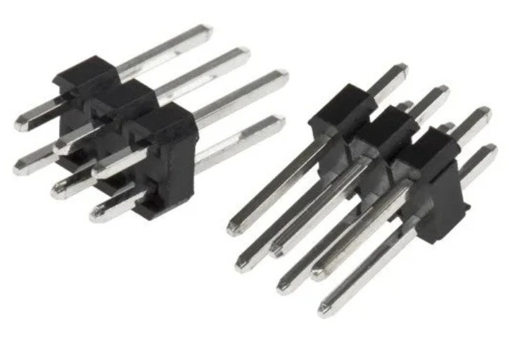
*A standard **2×3 (6-pin) 2.54 mm pin header** — this is what an SAO connector is. (These headers are
optional — many builds skip them.)*

### Step 7 — Electrolytic capacitor (C1, 100 µF) — **polarity matters**
The barrel-shaped **100 µF** cap has a **+ and a − leg**: the **longer leg is +**, and the body has a
**stripe marking the − side**. The board marks **+** — match it. Backwards can make it fail (or pop).
It's the **tallest of the small parts**, so it goes on now — after the flat, low parts and just before
the bodge and battery holder.

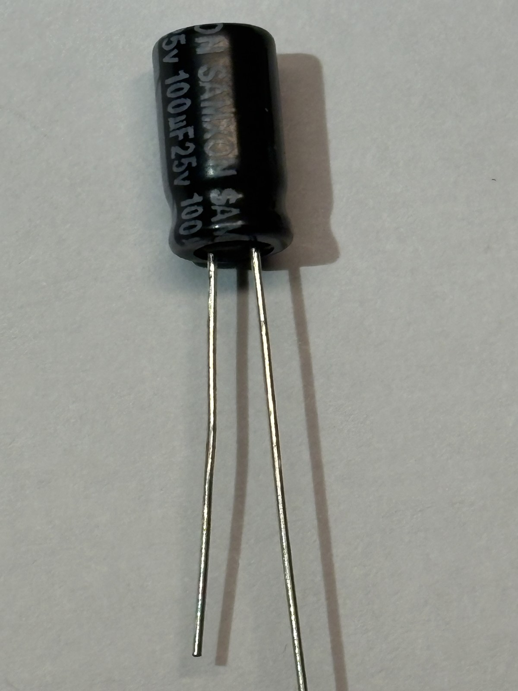
*The 100 µF electrolytic (C1). The **longer leg is +**; the printed **stripe down the body marks the − side**. Match **+** to the board's + mark.*

### Step 8 — The required bodge (do NOT skip)
This revision left the transistor's **collector** disconnected from **+ power (VCC)**. Add **one short
jumper wire**:

- **From:** Q1's **collector** leg — the **rightmost** pin (with the flat face toward you), i.e. the "C"
  in E·B·C.
- **To:** any **VCC / + power** point. Easiest solder targets: **U1 pin 8**, or **U1 pin 4**, or the
  **+ terminal of the battery holder (BT1 +)**.

Strip a little wire, tack one end to the collector pad/leg and the other to your chosen VCC point, keep
it tidy and clear of other pads. **This is what makes the LEDs light.**


### Step 9 — Battery holder (BT1) — tallest part last
Solder the **3×AA holder**. Watch the **+ / −** markings — the holder's red/+ wire or pad goes to the
board's **+**. This badge needs **3 AA cells (4.5 V)** because the NE555P chip won't run reliably below
4.5 V.

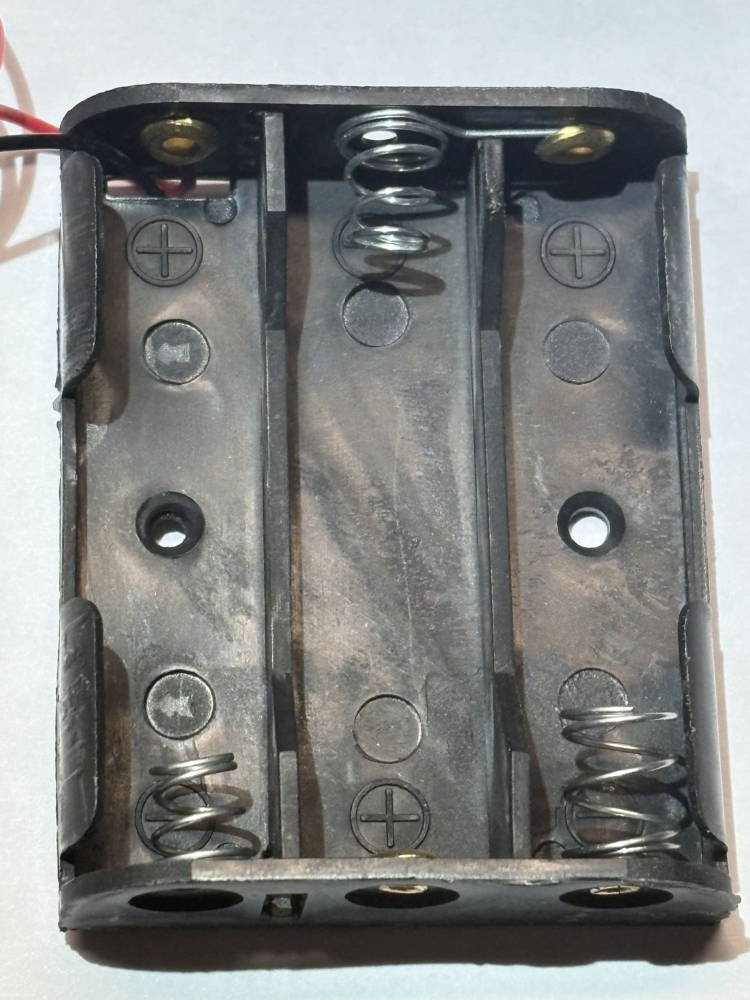

---

## Bring-up — is it alive?

1. **Seat the chip:** press the **NE555P** into its socket, **notch / pin-1 matching** the board (skip
   if you soldered the chip directly in Step 1).
2. Double-check: **chip notch** right way, **C1 + and −** right way, **LED flat sides** right way,
   **Q1 flat face** matching the outline, and your **Step 8 jumper** in place.
3. Pop in **3 AA batteries**.
4. **You're done when:** both LEDs **fade up and down together** — a slow "breathe," roughly one full
   cycle every **~3 seconds**. 🎉

**▶️ [Watch the finished badge breathe](assets/badge-10-alive.mp4)**
*The finished badge — both LED eyes breathing.*

---

## Troubleshooting — LEDs won't breathe?

| Symptom | Most likely cause | Fix |
|---------|-------------------|-----|
| **Totally dark** | **Missing Step 8 bodge** (collector not on VCC) | add the jumper — this is #1 |
| Totally dark | Batteries in backwards / dead / only 2 installed | need **3** fresh AA, right polarity |
| Dark or barely lit | **Q1 in backwards** | flat face must match the outline (2N3904 = E·B·C) |
| Dark | **Chip backwards** | notch/pin-1 must match the board |
| One LED never lights | that **LED is backwards** | flip it (long leg = +) |
| Nothing / erratic | **Solder bridge** (two pads joined) | inspect under light, reflow/wick the bridge |
| Nothing | **C1 electrolytic backwards** | + and − must match the board |
| Solid (not breathing) | wrong values / R1 or C1 issue | confirm R1 = 22 kΩ, C1 = 100 µF |

Still stuck? Reflow every joint (shiny cone = good; dull/blobby = reheat), and check continuity with a
multimeter from the battery + to U1 pin 8.

---

## What you just built

A **555 astable oscillator** makes a slow up-and-down voltage on C1; the **2N3904 transistor** acts as a
follower so the LED brightness tracks that voltage — giving the **breathe**. Swap **R1** (bigger =
slower) to change the pace. Add an **SAO** to either port to expand it. Welcome to hardware. 🖤

*Questions or a board that won't behave? Bring it to a BitHaven solder session — we'll debug it together.*
